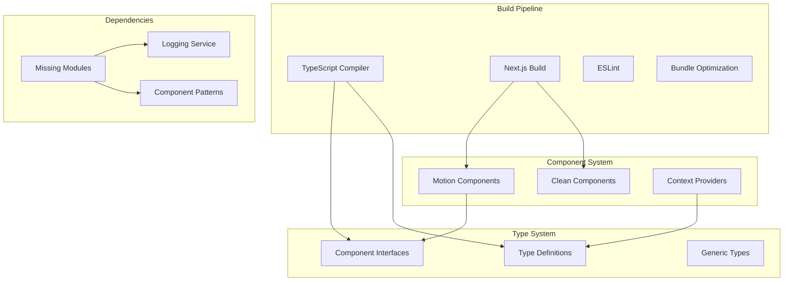

# Design Document

## Overview

This design document outlines the systematic approach to fixing build issues in the Mikhail Ajaj Portfolio project. The solution focuses on resolving TypeScript configuration problems, implementing missing dependencies, fixing motion component issues, and ensuring all documented architectural features are verifiable.

## Architecture

### Build System Architecture



### Error Resolution Strategy

1. **TypeScript Configuration**
   - Fix motion component type definitions
   - Resolve implicit any types
   - Ensure strict mode compatibility

2. **Dependency Resolution**
   - Create missing module implementations
   - Fix import paths and exports
   - Implement required interfaces

3. **Component Architecture**
   - Fix motion component implementations
   - Ensure proper error boundaries
   - Maintain clean code patterns

## Components and Interfaces

### Core Missing Modules

#### CleanComponentPatterns Module

```typescript
// lib/components/CleanComponentPatterns.ts
export interface BaseComponentProps {
  className?: string;
  children?: React.ReactNode;
  'data-testid'?: string;
  'aria-label'?: string;
  id?: string;
}

export interface InteractiveComponentProps extends BaseComponentProps {
  onClick?: () => void;
  onKeyDown?: (event: React.KeyboardEvent) => void;
  disabled?: boolean;
  loading?: boolean;
}

export interface CompoundComponentProps extends BaseComponentProps {
  // Additional compound component props
}

export type CardComponent = React.FC<any>;

export const withPerformanceTracking = <T extends object>(
  Component: React.ComponentType<T>,
  componentName: string
) => {
  return React.forwardRef<any, T>((props, ref) => {
    // Performance tracking implementation
    return <Component {...props} ref={ref} />;
  });
};

export const CleanErrorBoundary: React.FC<{ children: React.ReactNode }> = ({ children }) => {
  return <ErrorBoundary>{children}</ErrorBoundary>;
};
```

#### Logging Integration Module

```typescript
// lib/logging/LoggingIntegration.ts
export interface ComponentLogger {
  logUserInteraction: (
    action: string,
    component: string,
    metadata?: any,
  ) => void;
  logDebug: (message: string, metadata?: any) => void;
  logError: (message: string, error: Error, metadata?: any) => void;
}

export const useComponentLogger = (componentName: string): ComponentLogger => {
  return {
    logUserInteraction: (action, component, metadata) => {
      console.log(`[${componentName}] User interaction:`, {
        action,
        component,
        metadata,
      });
    },
    logDebug: (message, metadata) => {
      console.log(`[${componentName}] Debug:`, message, metadata);
    },
    logError: (message, error, metadata) => {
      console.error(`[${componentName}] Error:`, message, error, metadata);
    },
  };
};
```

### Motion Component Fixes

#### Type-Safe Motion Components

```typescript
// components/ui/MotionComponents.tsx
import { motion, MotionProps } from 'framer-motion';
import React from 'react';

export interface MotionDivProps extends MotionProps {
  className?: string;
  children?: React.ReactNode;
}

export const MotionDiv: React.FC<MotionDivProps> = ({ children, ...props }) => {
  return <motion.div {...props}>{children}</motion.div>;
};

export const MotionForm: React.FC<MotionDivProps & { onSubmit?: (e: React.FormEvent) => void }> = ({
  children,
  onSubmit,
  ...props
}) => {
  return <motion.form onSubmit={onSubmit} {...props}>{children}</motion.form>;
};

export const MotionButton: React.FC<MotionDivProps & { onClick?: () => void }> = ({
  children,
  onClick,
  ...props
}) => {
  return <motion.button onClick={onClick} {...props}>{children}</motion.button>;
};
```

### Error Boundary Implementation

```typescript
// components/ui/ErrorBoundary.tsx
interface ErrorBoundaryState {
  hasError: boolean;
  error?: Error;
}

export default class ErrorBoundary extends React.Component<
  { children: React.ReactNode; fallback?: React.ComponentType<any> },
  ErrorBoundaryState
> {
  constructor(props: any) {
    super(props);
    this.state = { hasError: false };
  }

  static getDerivedStateFromError(error: Error): ErrorBoundaryState {
    return { hasError: true, error };
  }

  componentDidCatch(error: Error, errorInfo: React.ErrorInfo) {
    console.error('Error caught by boundary:', error, errorInfo);
  }

  render() {
    if (this.state.hasError) {
      const Fallback = this.props.fallback || DefaultErrorFallback;
      return <Fallback error={this.state.error} />;
    }

    return this.props.children;
  }
}

const DefaultErrorFallback: React.FC<{ error?: Error }> = ({ error }) => (
  <div className="p-4 border border-red-200 rounded-lg bg-red-50">
    <h3 className="text-red-800 font-semibold">Something went wrong</h3>
    <p className="text-red-600 text-sm mt-1">{error?.message || 'An unexpected error occurred'}</p>
  </div>
);
```

## Data Models

### Build Configuration

```typescript
// types/build.ts
export interface BuildConfig {
  typescript: {
    strict: boolean;
    skipLibCheck: boolean;
    ignoreBuildErrors: boolean;
  };
  nextjs: {
    experimental: {
      optimizePackageImports: string[];
      webpackMemoryOptimizations: boolean;
    };
  };
  performance: {
    bundleAnalyzer: boolean;
    optimizeImages: boolean;
    codesplitting: boolean;
  };
}

export interface ComponentError {
  component: string;
  error: string;
  file: string;
  line: number;
  suggestion: string;
}
```

## Error Handling

### Systematic Error Resolution

1. **TypeScript Errors**
   - Identify all type mismatches
   - Create proper interface definitions
   - Fix implicit any types
   - Ensure strict mode compatibility

2. **Import Resolution**
   - Create missing module implementations
   - Fix relative import paths
   - Ensure proper exports

3. **Component Errors**
   - Fix motion component type issues
   - Implement proper error boundaries
   - Add fallback components

4. **Build Pipeline**
   - Optimize webpack configuration
   - Fix static generation issues
   - Ensure proper asset handling

### Error Recovery Strategy

```typescript
// utils/errorRecovery.ts
export const withErrorRecovery = <T extends object>(
  Component: React.ComponentType<T>,
  fallback?: React.ComponentType<any>
) => {
  return (props: T) => (
    <ErrorBoundary fallback={fallback}>
      <Component {...props} />
    </ErrorBoundary>
  );
};

export const createSafeComponent = <T extends object>(
  componentFactory: () => React.ComponentType<T>,
  fallback: React.ComponentType<T>
) => {
  try {
    return componentFactory();
  } catch (error) {
    console.warn('Component creation failed, using fallback:', error);
    return fallback;
  }
};
```

## Testing Strategy

### Build Verification Tests

1. **Compilation Tests**
   - Verify TypeScript compilation
   - Check Next.js build success
   - Validate static generation

2. **Component Tests**
   - Test motion component rendering
   - Verify error boundary functionality
   - Check context provider behavior

3. **Performance Tests**
   - Measure re-render counts
   - Verify cache hit rates
   - Test bundle size optimization

4. **Integration Tests**
   - End-to-end build pipeline
   - Component interaction testing
   - Error handling verification

### Verification Checklist

- [ ] All TypeScript errors resolved
- [ ] All imports resolve correctly
- [ ] Motion components render without errors
- [ ] Error boundaries catch and handle failures
- [ ] Performance optimizations are measurable
- [ ] Build completes successfully
- [ ] Static generation works for all pages
- [ ] Bundle optimization is effective
