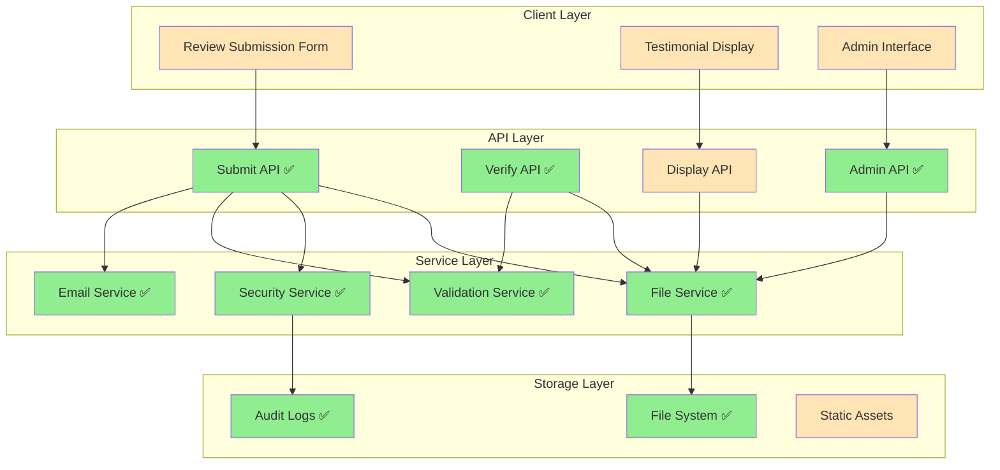
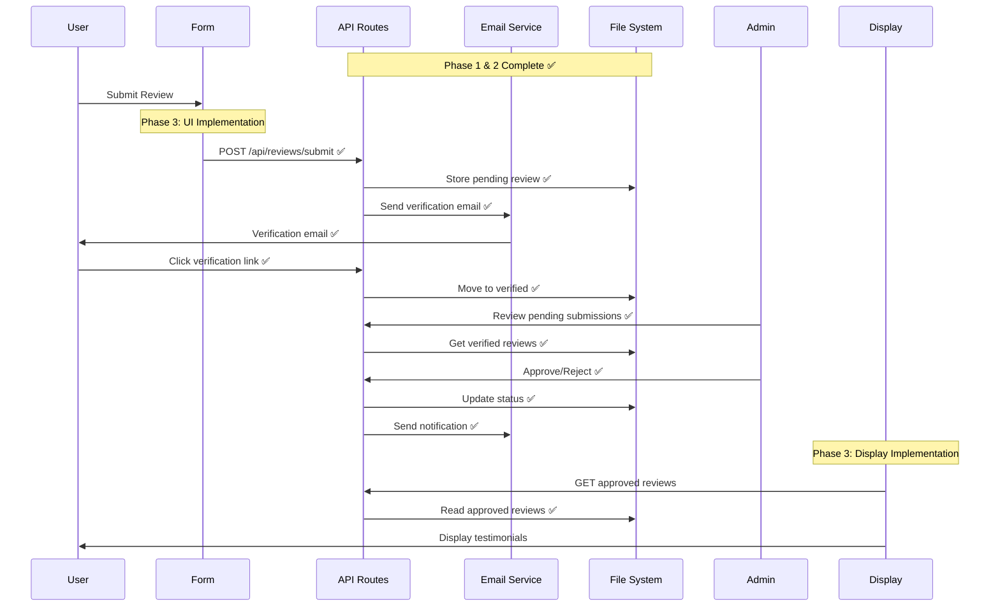

# Design Document

## Overview

The testimonial review system design builds upon the completed Phase 1 (Foundation & Core System) and Phase 2 (Verification & Security) to deliver a complete, production-ready testimonial collection and display system. This design focuses on the remaining phases: UI/UX implementation, performance optimization, and deployment readiness.

The system leverages the existing Next.js 15 architecture, Radix UI components, and Tailwind CSS styling while maintaining zero operational costs through file-based storage and free-tier services.

## Architecture

### System Architecture Overview



### Data Flow Architecture



## Components and Interfaces

### Core Component Architecture

```typescript
// Component hierarchy following existing patterns
interface ReviewSystemComponents {
  // Form Components (Phase 3)
  ReviewForm: {
    PersonalInfoStep: React.FC<PersonalInfoStepProps>;
    ReviewContentStep: React.FC<ReviewContentStepProps>;
    VerificationStep: React.FC<VerificationStepProps>;
    SuccessStep: React.FC<SuccessStepProps>;
  };
  
  // Display Components (Phase 3)
  ReviewDisplay: {
    TestimonialGrid: React.FC<TestimonialGridProps>;
    ReviewCard: React.FC<ReviewCardProps>;
    FeaturedReviews: React.FC<FeaturedReviewsProps>;
    ReviewStats: React.FC<ReviewStatsProps>;
  };
  
  // Admin Components (Phase 3)
  AdminInterface: {
    PendingReviews: React.FC<PendingReviewsProps>;
    ReviewManager: React.FC<ReviewManagerProps>;
    Analytics: React.FC<AnalyticsProps>;
    SecurityMonitor: React.FC<SecurityMonitorProps>;
  };
  
  // Shared Components
  Shared: {
    RatingDisplay: React.FC<RatingDisplayProps>;
    ReviewerProfile: React.FC<ReviewerProfileProps>;
    StatusBadge: React.FC<StatusBadgeProps>;
    LoadingStates: React.FC<LoadingStatesProps>;
  };
}
```

### Component Interface Definitions

```typescript
// Following existing component patterns from the codebase
interface ReviewCardProps {
  review: ApprovedReview;
  variant?: 'default' | 'featured' | 'compact';
  showActions?: boolean;
  className?: string;
}

interface TestimonialGridProps {
  reviews: ApprovedReview[];
  layout?: 'grid' | 'masonry' | 'list';
  pagination?: {
    enabled: boolean;
    itemsPerPage: number;
  };
  filters?: {
    rating?: number;
    relationship?: ReviewerRelationship;
    featured?: boolean;
  };
  className?: string;
}

interface ReviewFormProps {
  onSubmit: (data: ReviewSubmissionData) => Promise<void>;
  onSuccess?: (reviewId: string) => void;
  onError?: (error: Error) => void;
  className?: string;
}

interface AdminInterfaceProps {
  initialData?: {
    pendingCount: number;
    recentActivity: AdminAction[];
  };
  permissions?: AdminPermissions;
  className?: string;
}
```

### Integration with Existing UI System

```typescript
// Leveraging existing component library
import { Button } from '@/components/ui/button';
import { Card, CardContent, CardHeader } from '@/components/ui/card';
import { Dialog, DialogContent, DialogHeader } from '@/components/ui/dialog';
import { Form, FormControl, FormField, FormItem, FormLabel } from '@/components/ui/form';
import { Input } from '@/components/ui/input';
import { Textarea } from '@/components/ui/textarea';
import { Badge } from '@/components/ui/badge';
import { Separator } from '@/components/ui/separator';

// Using existing theme system
import { useTheme } from '@/lib/contexts/DomainThemeContext';
import { cn } from '@/lib/utils';

// Following existing animation patterns
import { MotionDiv, MotionCard } from '@/lib/motion-utils';
```

## Data Models

### Enhanced Review Data Model

```typescript
// Building on existing Phase 1 & 2 interfaces
interface Review {
  id: string;
  status: ReviewStatus;
  
  // Reviewer information (Phase 1 ✅)
  reviewer: ReviewerProfile;
  
  // Review content (Phase 1 ✅)
  content: ReviewContent;
  
  // Metadata (Phase 1 ✅)
  metadata: ReviewMetadata;
  
  // Admin fields (Phase 2 ✅)
  admin: AdminFields;
  
  // Display fields (Phase 3 - New)
  display: {
    featured: boolean;
    displayOrder: number;
    showOnHomepage: boolean;
    customExcerpt?: string;
    tags: string[];
    associatedProjects: string[];
  };
  
  // Analytics fields (Phase 4 - New)
  analytics: {
    views: number;
    clicks: number;
    shares: number;
    lastViewed?: string;
    engagement: number; // Calculated score
  };
}

// Display-optimized interfaces
interface ApprovedReview extends Omit<Review, 'status'> {
  status: 'approved';
  displayData: {
    excerpt: string;
    readTime: number;
    shareUrl: string;
    socialImage?: string;
  };
}

interface FeaturedReview extends ApprovedReview {
  display: ApprovedReview['display'] & {
    featured: true;
    featuredReason: string;
    featuredUntil?: string;
  };
}
```

### Component State Models

```typescript
// Form state management
interface ReviewFormState {
  currentStep: number;
  totalSteps: number;
  data: Partial<ReviewSubmissionData>;
  validation: {
    errors: Record<string, string>;
    touched: Record<string, boolean>;
  };
  submission: {
    isSubmitting: boolean;
    isSuccess: boolean;
    error?: string;
  };
}

// Display state management
interface ReviewDisplayState {
  reviews: ApprovedReview[];
  loading: boolean;
  error?: string;
  filters: ReviewFilters;
  pagination: PaginationState;
  layout: 'grid' | 'list' | 'masonry';
}

// Admin state management
interface AdminState {
  pendingReviews: VerifiedReview[];
  selectedReview?: VerifiedReview;
  bulkActions: {
    selected: string[];
    action?: 'approve' | 'reject';
  };
  statistics: AdminStatistics;
}
```

## Error Handling

### Comprehensive Error Management

```typescript
// Error types following existing patterns
class ReviewSystemError extends Error {
  constructor(
    message: string,
    public code: string,
    public statusCode: number = 500,
    public context?: Record<string, any>
  ) {
    super(message);
    this.name = 'ReviewSystemError';
  }
}

// Specific error classes
class ValidationError extends ReviewSystemError {
  constructor(field: string, message: string) {
    super(`Validation failed for ${field}: ${message}`, 'VALIDATION_ERROR', 400);
  }
}

class RateLimitError extends ReviewSystemError {
  constructor(limit: string, resetTime: number) {
    super(`Rate limit exceeded for ${limit}`, 'RATE_LIMIT_ERROR', 429, { resetTime });
  }
}

class VerificationError extends ReviewSystemError {
  constructor(reason: string) {
    super(`Email verification failed: ${reason}`, 'VERIFICATION_ERROR', 400);
  }
}

// Error boundary integration
interface ReviewErrorBoundaryProps {
  children: React.ReactNode;
  fallback?: React.ComponentType<{ error: Error; reset: () => void }>;
  onError?: (error: Error, errorInfo: ErrorInfo) => void;
}
```

### Error Recovery Strategies

```typescript
// Retry mechanisms
interface RetryConfig {
  maxAttempts: number;
  backoffMs: number;
  retryableErrors: string[];
}

// Graceful degradation
interface FallbackStrategies {
  reviewDisplay: {
    showCached: boolean;
    showPlaceholder: boolean;
    enableOfflineMode: boolean;
  };
  formSubmission: {
    saveToLocalStorage: boolean;
    showRetryButton: boolean;
    enableDraftMode: boolean;
  };
}
```

## Testing Strategy

### Testing Architecture

```typescript
// Test categories following existing patterns
interface TestSuite {
  unit: {
    components: string[];
    utilities: string[];
    hooks: string[];
    services: string[];
  };
  integration: {
    workflows: string[];
    apiRoutes: string[];
    userJourneys: string[];
  };
  e2e: {
    criticalPaths: string[];
    crossBrowser: string[];
    accessibility: string[];
  };
  performance: {
    loadTesting: string[];
    renderTesting: string[];
    bundleAnalysis: string[];
  };
}

// Test utilities
interface TestHelpers {
  mockReview: (overrides?: Partial<Review>) => Review;
  mockReviewer: (overrides?: Partial<ReviewerProfile>) => ReviewerProfile;
  renderWithProviders: (component: React.ReactElement) => RenderResult;
  createMockApiResponse: (data: any, status?: number) => MockResponse;
}
```

### Component Testing Strategy

```typescript
// Component test patterns
describe('ReviewCard Component', () => {
  it('should render review content correctly', () => {
    const mockReview = createMockReview();
    render(<ReviewCard review={mockReview} />);
    
    expect(screen.getByText(mockReview.content.testimonial)).toBeInTheDocument();
    expect(screen.getByText(mockReview.reviewer.name)).toBeInTheDocument();
  });
  
  it('should handle different variants', () => {
    const mockReview = createMockReview();
    const { rerender } = render(<ReviewCard review={mockReview} variant="featured" />);
    
    expect(screen.getByTestId('review-card')).toHaveClass('featured');
    
    rerender(<ReviewCard review={mockReview} variant="compact" />);
    expect(screen.getByTestId('review-card')).toHaveClass('compact');
  });
});
```

## Performance Optimization

### Optimization Strategy

```typescript
// Performance targets
interface PerformanceTargets {
  pageLoad: {
    LCP: 2000; // ms
    FID: 100;  // ms
    CLS: 0.1;  // score
  };
  api: {
    responseTime: 200; // ms
    throughput: 100;   // requests/second
  };
  bundle: {
    initialSize: 500;  // KB
    chunkSize: 100;    // KB
  };
}

// Optimization techniques
interface OptimizationStrategies {
  codesplitting: {
    routeLevel: boolean;
    componentLevel: boolean;
    dynamicImports: boolean;
  };
  caching: {
    staticGeneration: boolean;
    incrementalRegeneration: boolean;
    clientSideCache: boolean;
  };
  imageOptimization: {
    nextImageOptimization: boolean;
    webpConversion: boolean;
    lazyLoading: boolean;
  };
}
```

### Caching Strategy

```typescript
// Multi-layer caching
interface CachingLayers {
  static: {
    approvedReviews: 3600; // 1 hour
    featuredReviews: 7200; // 2 hours
    reviewStats: 1800;     // 30 minutes
  };
  dynamic: {
    pendingReviews: 0;     // No cache
    adminActions: 0;       // No cache
    userSessions: 900;     // 15 minutes
  };
  client: {
    reviewData: 300;       // 5 minutes
    userPreferences: 86400; // 24 hours
  };
}

// Cache invalidation
interface CacheInvalidation {
  triggers: {
    reviewApproval: string[];
    reviewRejection: string[];
    featuredUpdate: string[];
  };
  strategies: {
    immediate: boolean;
    scheduled: boolean;
    onDemand: boolean;
  };
}
```

## Security Considerations

### Security Architecture (Building on Phase 2)

```typescript
// Enhanced security measures
interface SecurityEnhancements {
  clientSide: {
    inputValidation: boolean;
    xssProtection: boolean;
    csrfTokens: boolean;
    contentSecurityPolicy: boolean;
  };
  apiLevel: {
    rateLimiting: boolean; // ✅ Implemented
    inputSanitization: boolean; // ✅ Implemented
    authenticationRequired: boolean;
    auditLogging: boolean; // ✅ Implemented
  };
  dataProtection: {
    encryptionAtRest: boolean;
    encryptionInTransit: boolean;
    dataMinimization: boolean;
    gdprCompliance: boolean;
  };
}

// Security monitoring
interface SecurityMonitoring {
  realTime: {
    suspiciousActivity: boolean;
    rateLimitViolations: boolean;
    authenticationFailures: boolean;
  };
  periodic: {
    securityAudits: boolean;
    vulnerabilityScans: boolean;
    dependencyUpdates: boolean;
  };
}
```

## Deployment Architecture

### Production Deployment Strategy

```typescript
// Deployment configuration
interface DeploymentConfig {
  platform: 'vercel' | 'netlify' | 'github-pages';
  environment: {
    production: EnvironmentConfig;
    staging: EnvironmentConfig;
    development: EnvironmentConfig;
  };
  cicd: {
    automated: boolean;
    testing: boolean;
    securityScanning: boolean;
    performanceTesting: boolean;
  };
}

// Environment configuration
interface EnvironmentConfig {
  apiKeys: {
    resend: string;
    analytics?: string;
    monitoring?: string;
  };
  features: {
    emailVerification: boolean;
    adminInterface: boolean;
    analytics: boolean;
    monitoring: boolean;
  };
  security: {
    rateLimiting: boolean;
    domainValidation: boolean;
    contentSanitization: boolean;
  };
}
```

### Monitoring and Observability

```typescript
// Monitoring stack
interface MonitoringStack {
  performance: {
    webVitals: boolean;
    apiMetrics: boolean;
    userExperience: boolean;
  };
  errors: {
    clientSideErrors: boolean;
    serverSideErrors: boolean;
    apiErrors: boolean;
  };
  business: {
    submissionRates: boolean;
    approvalRates: boolean;
    userEngagement: boolean;
  };
  security: {
    authenticationEvents: boolean;
    rateLimitViolations: boolean;
    suspiciousActivity: boolean;
  };
}
```

This design provides a comprehensive blueprint for completing the testimonial review system while maintaining consistency with existing architecture patterns and ensuring optimal performance, security, and user experience.