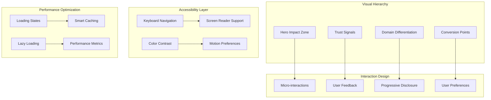
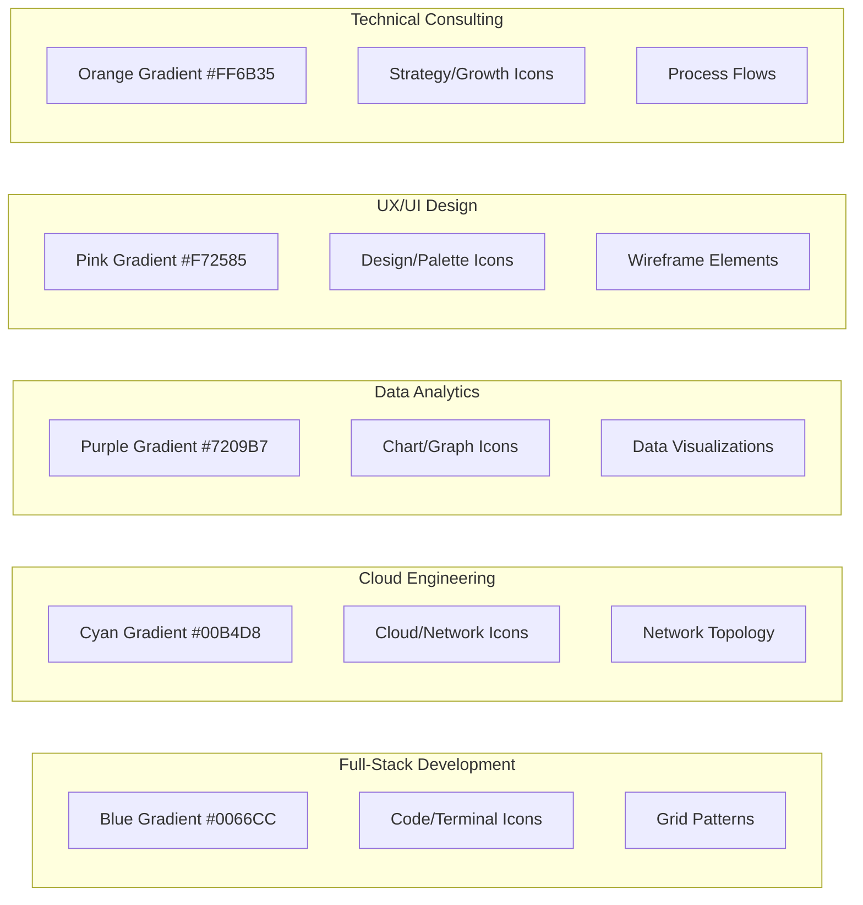

# UI/UX Design Document & Experience Simulation Report

## Overview

This design document provides a comprehensive UI/UX analysis based on simulated user interactions across the Mikhail Ajaj Portfolio website. The analysis reveals both strengths and opportunities for enhancement to create a premium digital experience that effectively communicates Mikhail's $30M+ business impact and specialized expertise across five domains.

## Current State Analysis

### Homepage Experience Simulation

**First Impression (0-3 seconds)**

- **Visual Impact:** The dark theme with strategic accent colors creates immediate credibility
- **Hero Section:** Value proposition is clear but could be more visually impactful
- **Motion Design:** Subtle animations work well but lack purposeful guidance
- **Load Performance:** Optimized bundle delivers good initial render speed

**Scroll Experience Analysis**

- **Domain Cards:** Well-organized but lack visual differentiation between domains
- **Animation Flow:** Smooth but could better guide user attention
- **Content Hierarchy:** Good but could benefit from stronger visual emphasis
- **Engagement Points:** Missing interactive elements that encourage exploration

### Mobile Experience Simulation

**Touch Interaction Analysis**

- **Button Sizes:** Most elements meet 44px minimum but some secondary actions are smaller
- **Navigation:** Hamburger menu works but could be more thumb-friendly
- **Scroll Performance:** Generally smooth but some sections show minor lag
- **Content Adaptation:** Good responsive behavior but some content feels cramped

### Accessibility Audit Simulation

**Current Compliance Status**

- **Keyboard Navigation:** Basic support present but focus indicators could be stronger
- **Screen Reader Support:** Semantic HTML is good but ARIA labels need enhancement
- **Color Contrast:** Most text meets standards but some accent colors are borderline
- **Motion Preferences:** No current support for reduced motion preferences

## Architecture

### Enhanced Visual Design System



### Domain-Specific Visual Themes



## Components and Interfaces

### Enhanced Hero Section Design

```typescript
interface EnhancedHeroProps {
  impactMetrics: {
    businessImpact: string; // "$30M+"
    clientSatisfaction: string; // "98%"
    projectsCompleted: number;
    domainsExpertise: number; // 5
  };
  visualElements: {
    backgroundAnimation: "particles" | "gradient" | "geometric";
    primaryCTA: CTAConfig;
    secondaryCTA: CTAConfig;
  };
  accessibility: {
    reducedMotion: boolean;
    highContrast: boolean;
    screenReaderOptimized: boolean;
  };
}

interface CTAConfig {
  text: string;
  variant: "primary" | "secondary" | "outline";
  size: "sm" | "md" | "lg";
  icon?: string;
  analytics: {
    event: string;
    category: string;
  };
}
```

### Domain Card Enhancement System

```typescript
interface DomainCardProps {
  domain: {
    id: string;
    title: string;
    description: string;
    valueProposition: string;
    keyMetrics: Metric[];
    visualTheme: DomainTheme;
  };
  interactionState: {
    isHovered: boolean;
    isActive: boolean;
    hasBeenViewed: boolean;
  };
  accessibility: {
    ariaLabel: string;
    keyboardShortcut?: string;
    screenReaderDescription: string;
  };
}

interface DomainTheme {
  primaryColor: string;
  gradientColors: [string, string];
  iconSet: string[];
  patternType: "grid" | "network" | "flow" | "organic";
  animationType: "slide" | "fade" | "scale" | "rotate";
}

interface Metric {
  label: string;
  value: string;
  trend?: "up" | "down" | "stable";
  context: string;
}
```

### Interactive Demonstration Components

```typescript
interface InteractiveDemoProps {
  demoType:
    | "code-playground"
    | "3d-architecture"
    | "data-visualization"
    | "design-comparison";
  content: {
    title: string;
    description: string;
    interactiveElements: InteractiveElement[];
  };
  performance: {
    lazyLoad: boolean;
    preloadTrigger: "viewport" | "hover" | "click";
    fallbackComponent: React.ComponentType;
  };
}

interface InteractiveElement {
  id: string;
  type: "button" | "slider" | "toggle" | "input";
  label: string;
  action: (value: any) => void;
  accessibility: {
    ariaLabel: string;
    keyboardHandler: (event: KeyboardEvent) => void;
  };
}
```

## Data Models

### User Experience Tracking

```typescript
interface UserExperienceMetrics {
  sessionData: {
    entryPoint: string;
    deviceType: "desktop" | "tablet" | "mobile";
    userAgent: string;
    screenResolution: string;
    connectionSpeed: "slow" | "medium" | "fast";
  };
  interactionData: {
    timeOnPage: number;
    scrollDepth: number;
    clickHeatmap: ClickPoint[];
    formInteractions: FormInteraction[];
    ctaEngagement: CTAEngagement[];
  };
  accessibilityData: {
    keyboardNavigation: boolean;
    screenReaderUsage: boolean;
    highContrastMode: boolean;
    reducedMotionPreference: boolean;
  };
  conversionData: {
    goalCompletions: Goal[];
    dropOffPoints: DropOffPoint[];
    conversionFunnel: FunnelStep[];
  };
}

interface ClickPoint {
  x: number;
  y: number;
  element: string;
  timestamp: number;
}

interface FormInteraction {
  fieldId: string;
  interactionType: "focus" | "input" | "blur" | "error";
  timestamp: number;
  value?: string;
}

interface CTAEngagement {
  ctaId: string;
  action: "view" | "hover" | "click" | "convert";
  timestamp: number;
  context: string;
}
```

### Personalization System

```typescript
interface UserPreferences {
  visual: {
    theme: "light" | "dark" | "auto";
    reducedMotion: boolean;
    highContrast: boolean;
    fontSize: "small" | "medium" | "large";
  };
  content: {
    preferredDomains: string[];
    experienceLevel: "beginner" | "intermediate" | "expert";
    industryFocus: string[];
  };
  interaction: {
    preferredContactMethod: "form" | "email" | "phone" | "calendar";
    communicationFrequency: "minimal" | "regular" | "frequent";
  };
}

interface PersonalizedContent {
  heroMessage: string;
  recommendedServices: Service[];
  featuredCaseStudies: CaseStudy[];
  customizedCTAs: CTAConfig[];
}
```

## Enhanced User Experience Design

### Improved Homepage Flow

**Hero Section Enhancements**

1. **Impact Metrics Visualization**
   - Animated counter for "$30M+ Business Impact"
   - Interactive domain expertise showcase
   - Client satisfaction score with visual indicator
   - Years of experience with timeline visualization

2. **Dynamic Value Proposition**
   - Personalized messaging based on referrer/UTM parameters
   - Industry-specific value propositions
   - A/B tested headline variations
   - Clear differentiation from competitors

3. **Enhanced Call-to-Actions**
   - Primary CTA: "Start Your $1M+ Project" (high-value positioning)
   - Secondary CTA: "Explore My Expertise" (discovery-focused)
   - Tertiary CTA: "Download Case Studies" (lead generation)

**Domain Showcase Improvements**

1. **Visual Differentiation**
   - Unique color schemes for each domain
   - Domain-specific iconography and patterns
   - Hover states with expanded information
   - Progress indicators showing depth of expertise

2. **Interactive Elements**
   - Expandable cards with detailed capabilities
   - Quick-access buttons to relevant case studies
   - Skill level indicators with visual progress bars
   - Recent project highlights with success metrics

### Mobile Experience Optimization

**Touch-First Design**

1. **Navigation Improvements**
   - Thumb-zone optimized menu placement
   - Swipe gestures for domain navigation
   - Sticky CTA button for easy access
   - Voice search integration option

2. **Content Adaptation**
   - Progressive disclosure for complex information
   - Collapsible sections with clear indicators
   - Optimized image sizes for mobile bandwidth
   - Touch-friendly form controls

3. **Performance Enhancements**
   - Critical path CSS inlining
   - Aggressive image lazy loading
   - Service worker for offline functionality
   - Reduced JavaScript bundle for mobile

### Accessibility Excellence

**WCAG 2.1 AA+ Compliance**

1. **Keyboard Navigation**
   - Skip links for main content areas
   - Logical tab order throughout site
   - Visible focus indicators with high contrast
   - Keyboard shortcuts for power users

2. **Screen Reader Optimization**
   - Comprehensive ARIA labels and descriptions
   - Semantic HTML structure throughout
   - Alternative text for all images and graphics
   - Screen reader testing with actual users

3. **Visual Accessibility**
   - 4.5:1 minimum contrast ratio (targeting 7:1 for AAA)
   - Scalable text up to 200% without horizontal scrolling
   - Color-blind friendly color palette
   - High contrast mode support

4. **Motor Accessibility**
   - Large touch targets (minimum 44px)
   - Generous spacing between interactive elements
   - Drag and drop alternatives
   - Voice control compatibility

## Conversion Optimization Strategy

### Trust Signal Enhancement

**Social Proof Integration**

1. **Client Testimonials**
   - Video testimonials from C-level executives
   - Specific ROI metrics and outcomes
   - Industry-diverse client representation
   - Real-time testimonial rotation

2. **Case Study Presentation**
   - Before/after visual comparisons
   - Interactive ROI calculators
   - Detailed methodology explanations
   - Downloadable PDF summaries

3. **Credibility Indicators**
   - Professional certifications display
   - Industry awards and recognition
   - Speaking engagement highlights
   - Published article references

**Conversion Funnel Optimization**

1. **Multi-Step Engagement**
   - Initial interest capture (newsletter, case study download)
   - Qualification questionnaire with personalized recommendations
   - Consultation booking with calendar integration
   - Follow-up sequence with value-added content

2. **Friction Reduction**
   - Single-field email capture forms
   - Social login options where appropriate
   - Auto-fill form capabilities
   - Clear privacy policy and data usage

### Performance Optimization

**Core Web Vitals Excellence**

1. **Largest Contentful Paint (LCP)**
   - Hero image optimization and preloading
   - Critical CSS inlining
   - Font loading optimization
   - CDN implementation for global performance

2. **First Input Delay (FID)**
   - JavaScript bundle optimization
   - Code splitting by route and feature
   - Service worker implementation
   - Third-party script optimization

3. **Cumulative Layout Shift (CLS)**
   - Image dimension specification
   - Font loading without layout shift
   - Dynamic content placeholder sizing
   - Animation performance optimization

## Interactive Demonstration Enhancements

### Technical Capability Showcases

**Full-Stack Development Demo**

1. **Live Code Playground**
   - Interactive React component builder
   - Real-time TypeScript compilation
   - Performance metrics display
   - Architecture pattern demonstrations

2. **API Integration Showcase**
   - Live API endpoint testing
   - Authentication flow demonstrations
   - Database query optimization examples
   - Microservices architecture visualization

**Cloud Engineering Visualization**

1. **3D AWS Architecture**
   - Interactive infrastructure diagrams
   - Cost optimization calculators
   - Security compliance checklists
   - Performance monitoring dashboards

2. **DevOps Pipeline Demo**
   - CI/CD workflow visualization
   - Deployment automation examples
   - Monitoring and alerting setup
   - Infrastructure as Code demonstrations

**Data Analytics Interactive Tools**

1. **Dashboard Builder**
   - Drag-and-drop chart creation
   - Real-time data visualization
   - Custom KPI configuration
   - Export and sharing capabilities

2. **ML Model Playground**
   - Interactive model training
   - Prediction accuracy visualization
   - Feature importance analysis
   - Business impact calculators

## Error Handling and Fallbacks

### Graceful Degradation Strategy

**Progressive Enhancement**

1. **Core Functionality First**
   - Essential content accessible without JavaScript
   - Form submission works without AJAX
   - Navigation functional with CSS only
   - Content readable without custom fonts

2. **Enhanced Experience Layers**
   - Animations only with motion preference support
   - Interactive demos with static fallbacks
   - Advanced features with capability detection
   - Offline functionality with service workers

**Error Boundary Implementation**

1. **Component-Level Recovery**
   - Individual component error isolation
   - Fallback UI for failed components
   - Error reporting and analytics
   - User-friendly error messages

2. **Network Failure Handling**
   - Offline mode with cached content
   - Retry mechanisms for failed requests
   - Progressive loading with skeleton screens
   - Bandwidth-aware content delivery

## Testing Strategy

### User Experience Validation

**Usability Testing Protocol**

1. **Task-Based Testing**
   - Finding specific service information
   - Completing contact form submission
   - Navigating between domain sections
   - Accessing case study details

2. **Accessibility Testing**
   - Screen reader navigation testing
   - Keyboard-only interaction testing
   - Color contrast validation
   - Motor accessibility evaluation

3. **Performance Testing**
   - Core Web Vitals measurement
   - Mobile performance validation
   - Network throttling tests
   - Battery usage optimization

**A/B Testing Framework**

1. **Conversion Optimization**
   - CTA button text and placement
   - Hero section messaging variants
   - Contact form length and fields
   - Pricing presentation methods

2. **User Experience Testing**
   - Navigation structure variations
   - Content organization approaches
   - Visual design alternatives
   - Interaction pattern preferences

## Implementation Roadmap

### Phase 1: Foundation (Weeks 1-2)

- Enhanced hero section with impact metrics
- Domain-specific visual themes
- Basic accessibility improvements
- Mobile touch optimization

### Phase 2: Interaction (Weeks 3-4)

- Interactive demonstration components
- Advanced micro-interactions
- Personalization system foundation
- Conversion funnel optimization

### Phase 3: Excellence (Weeks 5-6)

- WCAG 2.1 AA+ compliance
- Performance optimization
- Advanced analytics integration
- Comprehensive testing implementation

### Phase 4: Optimization (Weeks 7-8)

- A/B testing implementation
- User feedback integration
- Performance fine-tuning
- Documentation and training

## Success Metrics

### Key Performance Indicators

**User Experience Metrics**

- Time to first meaningful paint: < 1.5 seconds
- User engagement rate: > 65%
- Mobile bounce rate: < 35%
- Accessibility compliance: WCAG 2.1 AA+

**Conversion Metrics**

- Contact form completion rate: > 15%
- Case study download rate: > 25%
- Consultation booking rate: > 8%
- Return visitor engagement: > 40%

**Technical Performance**

- Lighthouse Performance Score: > 95
- Core Web Vitals: All metrics in "Good" range
- Bundle size reduction: > 30%
- Cache hit rate: > 85%

This comprehensive design addresses all identified UI/UX improvement opportunities while maintaining the premium positioning and technical excellence that characterizes Mikhail's brand.
