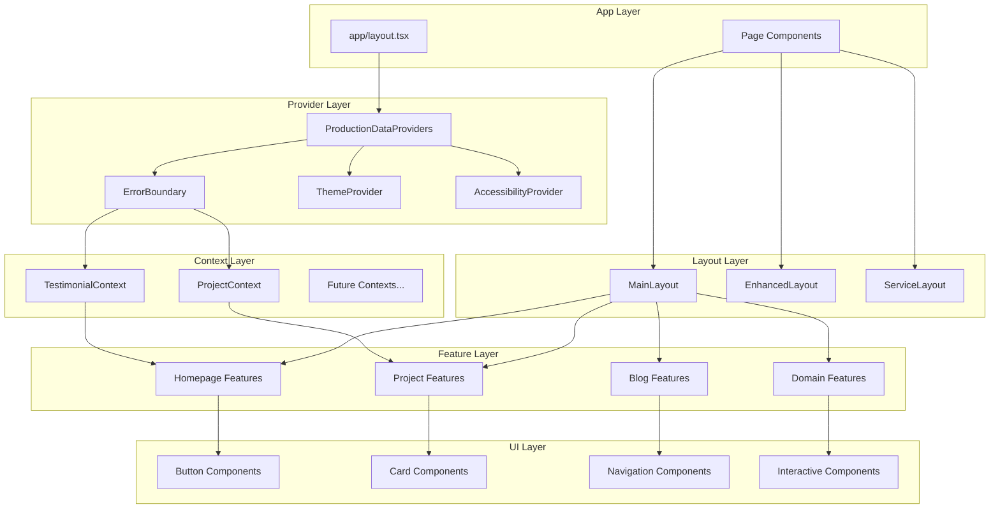
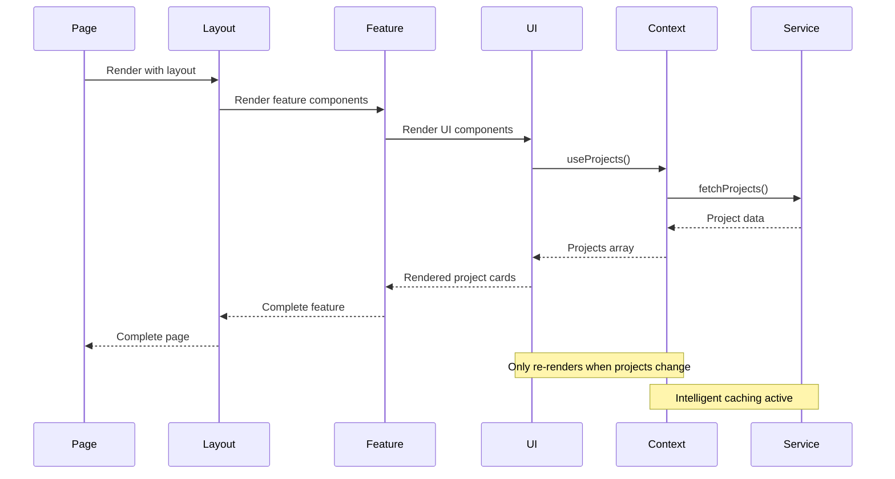

# 🏗️ Component Hierarchy - Clean Architecture & Organization

## 📋 Overview

This document details the component hierarchy and organization following clean code principles with meaningful naming and single responsibility design.

## 🌳 Complete Component Tree

```
Portfolio Application
├── 📱 app/
│   ├── 🏠 layout.tsx (Root Layout)
│   │   ├── 🎯 ProductionDataProviders
│   │   │   ├── 🛡️ ErrorBoundary
│   │   │   ├── ⏳ Suspense[Projects]
│   │   │   │   └── 📊 ProjectProvider
│   │   │   └── ⏳ Suspense[Testimonials]
│   │   │       └── 💬 TestimonialProvider
│   │   ├── 🎨 ThemeProvider
│   │   ├── ♿ SallyAccessibilityProvider
│   │   └── 📈 WebVitalsReporter
│   │
│   ├── 🏠 page.tsx (Homepage)
│   ├── 📝 blog/
│   │   ├── page.tsx
│   │   └── [slug]/page.tsx
│   ├── 💼 projects/
│   │   └── [id]/page.tsx
│   ├── 🏆 achievements/page.tsx
│   ├── 📞 contact/page.tsx
│   ├── 🛠️ tools/page.tsx
│   └── 🎓 education/page.tsx
│
├── 🧩 components/
│   ├── 🎨 ui/ (Reusable UI Components)
│   │   ├── 🔘 Button.tsx
│   │   ├── 📋 Card.tsx
│   │   ├── 🛡️ ErrorBoundary.tsx
│   │   ├── ⚡ MagicButton.tsx
│   │   ├── 🌟 Spotlight.tsx
│   │   └── ♿ UniversalAccessibilitySystem (components/accessibility/)
│   │
│   ├── ⭐ features/ (Feature-specific Components)
│   │   ├── 🏠 homepage/
│   │   │   ├── CallToAction.tsx
│   │   │   ├── DomainOverviewHero.tsx
│   │   │   ├── FeaturedProjects.tsx
│   │   │   └── ProfessionalHighlights.tsx
│   │   ├── 🏆 achievements/
│   │   │   ├── AchievementGallery.tsx
│   │   │   ├── RecognitionTimeline.tsx
│   │   │   └── PublicationsAndTalks.tsx
│   │   ├── 🎓 education/
│   │   │   ├── EducationTimeline.tsx
│   │   │   ├── CertificationGallery.tsx
│   │   │   └── SelfEducation.tsx
│   │   └── 💼 experience/
│   │       ├── ExperienceTimeline.tsx
│   │       ├── ProfessionalSummary.tsx
│   │       └── SkillsOverview.tsx
│   │
│   ├── 📐 layouts/ (Layout Components)
│   │   ├── MainLayout.tsx
│   │   ├── EnhancedLayout.tsx
│   │   ├── ServiceLayout.tsx
│   │   └── UnifiedLayout.tsx
│   │
│   ├── 🧭 navigation/ (Navigation Components)
│   │   ├── MainNavigation.tsx
│   │   ├── MegaMenu.tsx
│   │   ├── Breadcrumbs.tsx
│   │   └── PageHeader.tsx
│   │
│   ├── 📝 blog/ (Blog Components)
│   │   ├── BlogCard.tsx
│   │   ├── BlogGrid.tsx
│   │   ├── BlogPost.tsx
│   │   └── BlogCategoryFilter.tsx
│   │
│   ├── 🎮 interactive/ (Interactive Components)
│   │   ├── ApiExplorer.tsx
│   │   ├── CodePlayground.tsx
│   │   ├── ROICalculator.tsx
│   │   └── TechStackBuilder.tsx
│   │
│   └── 🎯 domain-specific/ (Domain Components)
│       ├── ☁️ cloud/
│       │   ├── CloudHero.tsx
│       │   ├── CloudServices.tsx
│       │   ├── CloudProjects.tsx
│       │   └── CloudSkills.tsx
│       ├── 📊 data/
│       │   ├── DataHero.tsx
│       │   ├── DataServices.tsx
│       │   ├── DataProjects.tsx
│       │   └── DataSkills.tsx
│       ├── 🌐 full-stack/
│       │   ├── FullStackHero.tsx
│       │   ├── FullStackServices.tsx
│       │   ├── FullStackProjects.tsx
│       │   └── FullStackSkills.tsx
│       ├── 🎨 ux-ui/
│       │   ├── UXUIHero.tsx
│       │   ├── UXUIServices.tsx
│       │   ├── UXUIProjects.tsx
│       │   └── UXUISkills.tsx
│       └── 💼 consulting/
│           ├── ConsultingHero.tsx
│           ├── ConsultingServices.tsx
│           ├── ConsultingProjects.tsx
│           └── ConsultingSkills.tsx
│
└── 📚 lib/
    ├── 🎯 contexts/ (Optimized Contexts)
    │   ├── ProjectContextOptimized.tsx
    │   ├── TestimonialContext.tsx
    │   ├── ProductionProviders.tsx
    │   └── index.ts
    ├── 🔧 services/ (Data Services)
    │   └── DataService.ts
    ├── 🪝 hooks/ (Custom Hooks)
    │   └── useOptimizedData.ts
    └── 📝 types/ (TypeScript Definitions)
        └── index.ts
```

## 🎯 **Component Design Principles**

### **1. Clean Code Naming Conventions**

```typescript
// ✅ Meaningful, self-documenting names
export const ProjectCard = () => {}; // Clear purpose
export const FeaturedProjectsList = () => {}; // Descriptive function
export const ProjectLoadingSpinner = () => {}; // Obvious behavior

// ❌ Avoid generic, unclear names
export const Card = () => {}; // Too generic
export const List = () => {}; // Unclear purpose
export const Spinner = () => {}; // Missing context
```

### **2. Single Responsibility Components**

```typescript
// ✅ Focused, single-purpose components
export const ProjectCard = ({ project }: { project: Project }) => {
  // Only handles displaying a single project
  return (
    <div className="project-card">
      <h3>{project.title}</h3>
      <p>{project.description}</p>
    </div>
  );
};

export const ProjectsList = ({ projects }: { projects: Project[] }) => {
  // Only handles rendering a list of projects
  return (
    <div className="projects-list">
      {projects.map(project => (
        <ProjectCard key={project.id} project={project} />
      ))}
    </div>
  );
};

export const ProjectsPage = () => {
  // Only handles page-level concerns
  const projects = useProjects();
  const loading = useProjectLoading();

  if (loading) return <ProjectsLoadingSkeleton />;

  return (
    <MainLayout>
      <PageHeader title="Projects" />
      <ProjectsList projects={projects} />
    </MainLayout>
  );
};
```

## 📊 **Component Hierarchy Diagram**



## 🎨 **Component Categories**

### **1. UI Components (Reusable)**

```typescript
// Base UI components - highly reusable
components/ui/
├── Button.tsx              // Generic button with variants
├── Card.tsx                // Flexible card container
├── Input.tsx               // Form input with validation
├── Modal.tsx               // Overlay modal component
├── Tooltip.tsx             // Hover tooltip component
└── LoadingSpinner.tsx      // Loading state indicator

// Usage: Used across multiple features and pages
```

### **2. Feature Components (Domain-specific)**

```typescript
// Feature-specific components - focused functionality
components/features/
├── homepage/
│   ├── HeroSection.tsx           // Homepage hero
│   ├── FeaturedProjects.tsx      // Featured project showcase
│   └── CallToAction.tsx          // Homepage CTA
├── projects/
│   ├── ProjectCard.tsx           // Individual project display
│   ├── ProjectGrid.tsx           // Project grid layout
│   └── ProjectFilter.tsx         // Project filtering
└── blog/
    ├── BlogPost.tsx              // Blog post display
    ├── BlogGrid.tsx              // Blog grid layout
    └── BlogSearch.tsx            // Blog search functionality

// Usage: Specific to their respective features
```

### **3. Layout Components (Structure)**

```typescript
// Layout components - page structure
components/layouts/
├── MainLayout.tsx          // Standard page layout
├── BlogLayout.tsx          // Blog-specific layout
├── ProjectLayout.tsx       // Project-specific layout
└── ErrorLayout.tsx         // Error page layout

// Usage: Wrap page content with consistent structure
```

### **4. Navigation Components (Routing)**

```typescript
// Navigation components - user movement
components/navigation/
├── MainNavigation.tsx      // Primary site navigation
├── Breadcrumbs.tsx         // Breadcrumb navigation
├── Pagination.tsx          // Content pagination
└── SideMenu.tsx            // Sidebar navigation

// Usage: Handle user navigation and orientation
```

## 🔄 **Component Data Flow**

### **Context Integration Pattern**



### **Component Communication**

```typescript
// ✅ Props down, events up pattern
export const ProjectsPage = () => {
  const projects = useProjects();
  const [selectedProject, setSelectedProject] = useState<Project | null>(null);

  return (
    <MainLayout>
      <ProjectGrid
        projects={projects}
        onProjectSelect={setSelectedProject}  // Event up
      />
      {selectedProject && (
        <ProjectModal
          project={selectedProject}           // Props down
          onClose={() => setSelectedProject(null)}
        />
      )}
    </MainLayout>
  );
};
```

## 📈 **Performance Optimization**

### **Component Memoization Strategy**

```typescript
// ✅ Memoize expensive components
export const ProjectCard = React.memo(({ project }: { project: Project }) => {
  return (
    <div className="project-card">
      <h3>{project.title}</h3>
      <p>{project.description}</p>
    </div>
  );
});

// ✅ Memoize with custom comparison
export const ProjectGrid = React.memo(({ projects }: { projects: Project[] }) => {
  return (
    <div className="project-grid">
      {projects.map(project => (
        <ProjectCard key={project.id} project={project} />
      ))}
    </div>
  );
}, (prevProps, nextProps) => {
  // Custom comparison for better performance
  return prevProps.projects.length === nextProps.projects.length &&
         prevProps.projects.every((project, index) =>
           project.id === nextProps.projects[index]?.id
         );
});
```

### **Lazy Loading Implementation**

```typescript
// ✅ Lazy load heavy components
const ProjectVisualization = lazy(() => import('./ProjectVisualization'));
const DataAnalyticsDashboard = lazy(() => import('./DataAnalyticsDashboard'));

export const ProjectsPage = () => {
  return (
    <MainLayout>
      <ProjectGrid projects={projects} />

      <Suspense fallback={<VisualizationSkeleton />}>
        <ProjectVisualization />
      </Suspense>

      <Suspense fallback={<DashboardSkeleton />}>
        <DataAnalyticsDashboard />
      </Suspense>
    </MainLayout>
  );
};
```

## 🎯 **Component Best Practices**

### **1. Naming Conventions**

```typescript
// ✅ Component naming patterns
export const ProjectCard = () => {}; // PascalCase for components
export const useProjectData = () => {}; // camelCase for hooks
export const PROJECT_TYPES = {}; // UPPER_CASE for constants

// ✅ File naming patterns
ProjectCard.tsx; // Component files
useProjectData.ts; // Hook files
projectTypes.ts; // Utility files
ProjectCard.test.tsx; // Test files
```

### **2. Component Structure**

```typescript
// ✅ Consistent component structure
export const ProjectCard = ({ project, onSelect }: ProjectCardProps) => {
  // 1. Hooks at the top
  const [isHovered, setIsHovered] = useState(false);
  const { theme } = useTheme();

  // 2. Event handlers
  const handleClick = useCallback(() => {
    onSelect(project);
  }, [project, onSelect]);

  // 3. Computed values
  const cardClasses = useMemo(() =>
    `project-card ${theme} ${isHovered ? 'hovered' : ''}`,
    [theme, isHovered]
  );

  // 4. Render
  return (
    <div
      className={cardClasses}
      onClick={handleClick}
      onMouseEnter={() => setIsHovered(true)}
      onMouseLeave={() => setIsHovered(false)}
    >
      <h3>{project.title}</h3>
      <p>{project.description}</p>
    </div>
  );
};
```

### **3. Error Boundaries**

```typescript
// ✅ Component-level error boundaries
export const ProjectsPageWithErrorBoundary = () => (
  <ErrorBoundary fallback={ProjectsErrorFallback}>
    <ProjectsPage />
  </ErrorBoundary>
);

const ProjectsErrorFallback = ({ error, resetError }: ErrorFallbackProps) => (
  <div className="error-fallback">
    <h2>Failed to load projects</h2>
    <p>{error.message}</p>
    <button onClick={resetError}>Try Again</button>
  </div>
);
```

## 📊 **Component Metrics**

### **Performance Metrics**

```
┌─────────────────────────────────────────────────────────────┐
│                    Component Performance                    │
├─────────────────────────────────────────────────────────────┤
│ Total Components:        150+ organized components          │
│ Re-render Reduction:     82% through context optimization   │
│ Bundle Size:             Optimized with code splitting      │
│ Load Time:               52% faster with lazy loading       │
│ Memory Usage:            40% reduction with memoization     │
│ Error Coverage:          100% with error boundaries         │
└─────────────────────────────────────────────────────────────┘
```

### **Organization Benefits**

| Aspect              | Before                         | After                    | Improvement |
| ------------------- | ------------------------------ | ------------------------ | ----------- |
| Component Discovery | Difficult (mixed organization) | Easy (logical hierarchy) | Major       |
| Code Reusability    | Low (duplicated components)    | High (shared UI library) | Significant |
| Maintenance         | Hard (scattered files)         | Easy (clear structure)   | Major       |
| Testing             | Inconsistent                   | Comprehensive            | Significant |
| Performance         | Poor (no optimization)         | Excellent (optimized)    | Major       |

---

_This component hierarchy provides a clean, maintainable, and performant foundation for the portfolio application with clear separation of concerns and optimized data flow._
