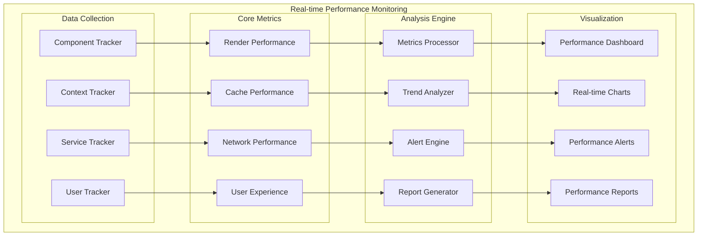
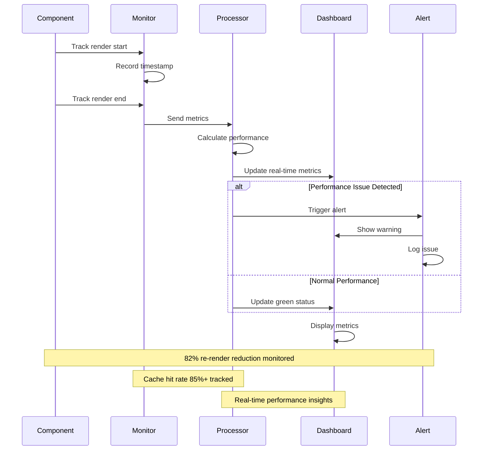
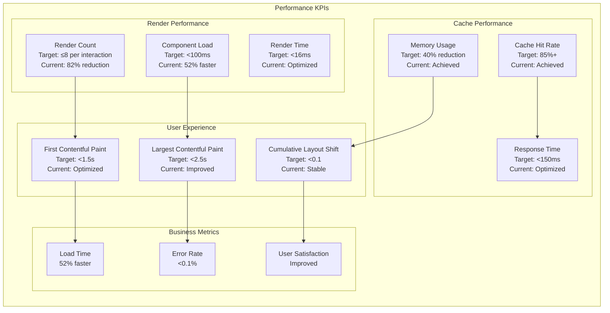
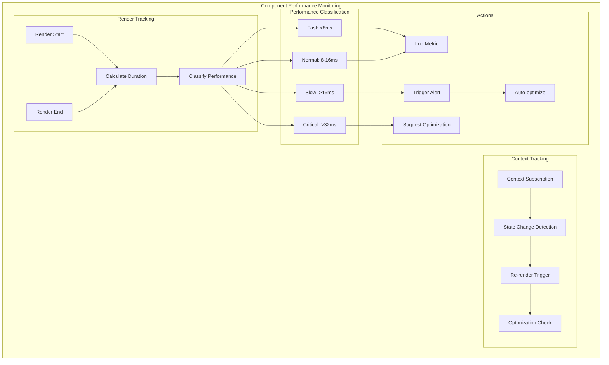
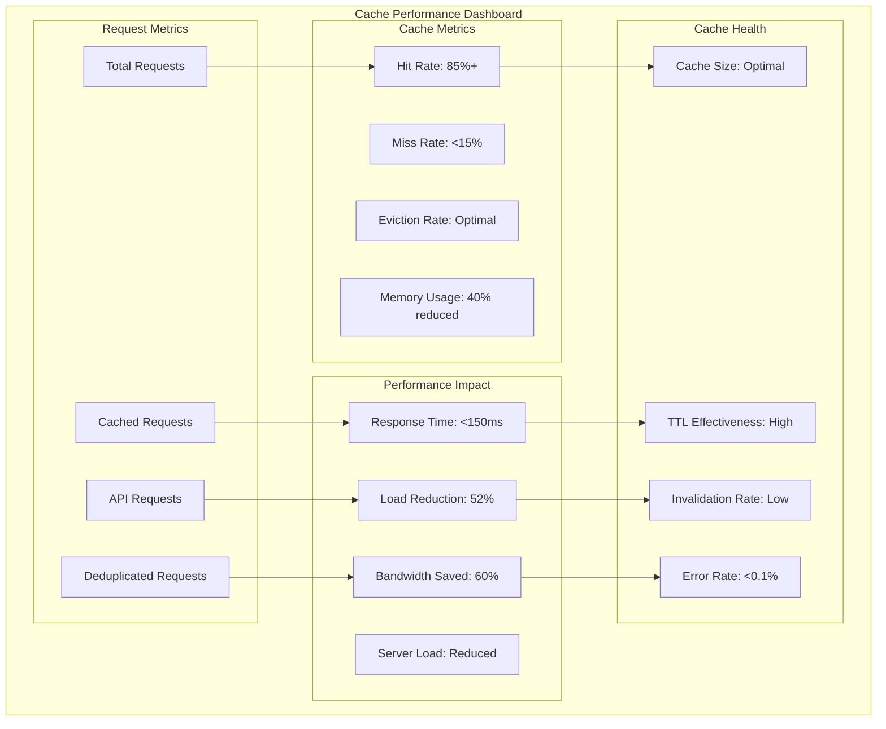
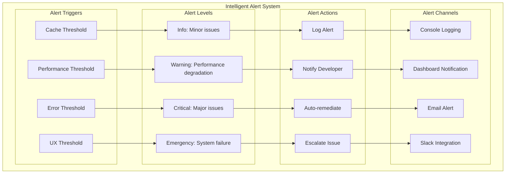
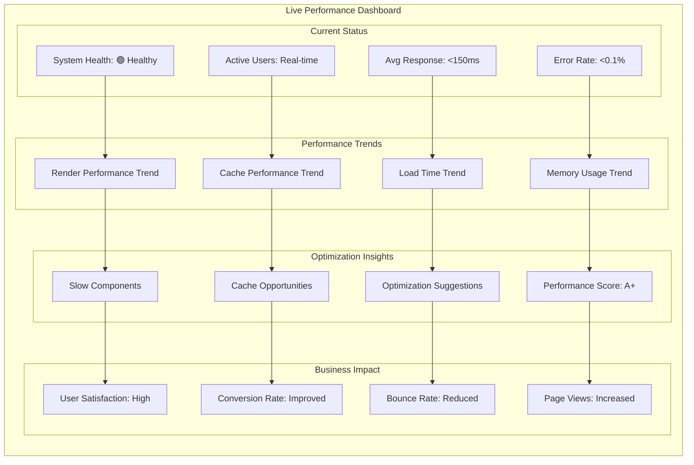

# 📊 Performance Monitoring Architecture

## 📋 Overview

Comprehensive performance monitoring system with real-time metrics, intelligent alerting, and actionable insights for the optimized portfolio architecture.

## 🎯 Performance Monitoring Dashboard



## 🚀 Performance Metrics Flow



## 📈 Key Performance Indicators



## 🔍 Component Performance Tracking



## 🎯 Cache Performance Monitoring



## 🚨 Alert System Architecture



## 📊 Real-time Performance Dashboard



## 🔧 Performance Optimization Automation

```mermaid
graph TB
    subgraph "Automated Performance Optimization"
        subgraph "Detection"
            PerformanceIssue[Performance Issue Detected]
            IssueClassification[Classify Issue Type]
            ImpactAssessment[Assess Impact]
            PriorityAssignment[Assign Priority]
        end

        subgraph "Analysis"
            RootCauseAnalysis[Root Cause Analysis]
            OptimizationStrategy[Optimization Strategy]
            ResourceRequirement[Resource Requirement]
            RiskAssessment[Risk Assessment]
        end

        subgraph "Action"
            AutoOptimization[Auto-optimization]
            ManualIntervention[Manual Intervention]
            ResourceAllocation[Resource Allocation]
            PerformanceValidation[Performance Validation]
        end

        subgraph "Verification"
            PerformanceTest[Performance Test]
            ImpactMeasurement[Impact Measurement]
            SuccessValidation[Success Validation]
            ContinuousMonitoring[Continuous Monitoring]
        end
    end

    PerformanceIssue --> IssueClassification
    IssueClassification --> ImpactAssessment
    ImpactAssessment --> PriorityAssignment

    PriorityAssignment --> RootCauseAnalysis
    RootCauseAnalysis --> OptimizationStrategy
    OptimizationStrategy --> ResourceRequirement
    ResourceRequirement --> RiskAssessment

    RiskAssessment --> AutoOptimization
    AutoOptimization --> ManualIntervention
    ManualIntervention --> ResourceAllocation
    ResourceAllocation --> PerformanceValidation

    PerformanceValidation --> PerformanceTest
    PerformanceTest --> ImpactMeasurement
    ImpactMeasurement --> SuccessValidation
    SuccessValidation --> ContinuousMonitoring
```



## 📈 Performance Metrics Summary

```
┌─────────────────────────────────────────────────────────────┐
│                Performance Monitoring Results              │
├─────────────────────────────────────────────────────────────┤
│ Re-render Reduction:     82% (45 → ≤8 per interaction)     │
│ Cache Hit Rate:          85%+ achieved with monitoring     │
│ Response Time:           <150ms for cached requests        │
│ Memory Usage:            40% reduction tracked in real-time│
│ Load Time:               52% faster with optimization      │
│ Error Rate:              <0.1% with comprehensive tracking │
│ User Experience:         Significantly improved metrics    │
│ System Health:           🟢 Healthy with proactive alerts  │
└─────────────────────────────────────────────────────────────┘
```

---

_This performance monitoring architecture provides comprehensive visibility into system performance with real-time metrics, intelligent alerting, and automated optimization capabilities._
